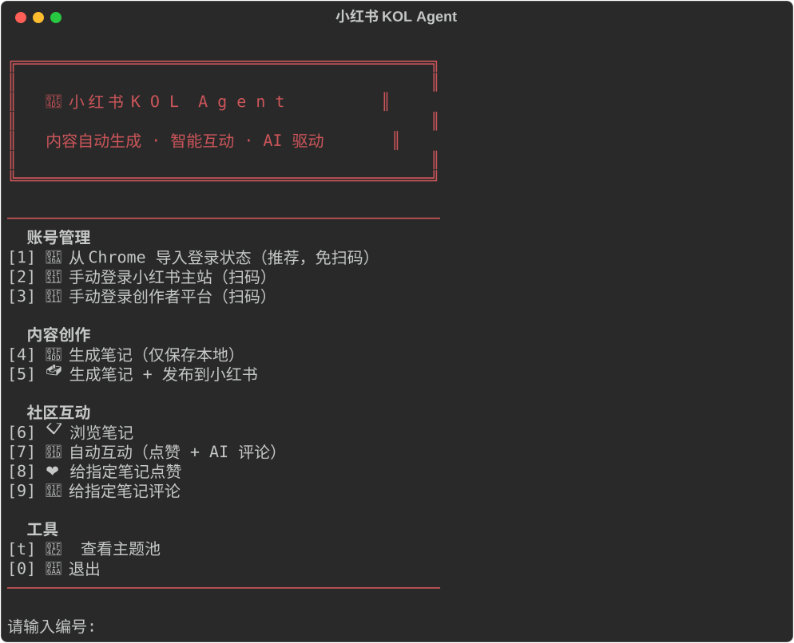

# 📕 小红书 KOL Agent

AI 驱动的小红书自动化 Agent — 自动搜索素材、生成小红书风格笔记并一键发布；同时支持自动浏览笔记、点赞、AI 生成评论互动。

## 功能亮点

- **AI 内容生成**: 输入主题 → 自动搜索素材 → 生成小红书爆款风格的图文笔记（轮播图 + 正文）
- **一键发布**: 生成后直接通过浏览器自动化发布到小红书
- **智能互动**: 自动浏览笔记、点赞、AI 生成个性化评论
- **LLM 灵活切换**: 支持 DeepSeek、ChatGPT、通义千问、智谱 GLM、Kimi、文心一言等，兼容所有 OpenAI API 格式的大模型
- **Cookie 持久化**: 扫码登录一次，后续自动使用保存的 Cookie

## 界面预览

<div align="center">
  
</div>

## Quick Start

### 1. 安装依赖

```bash
python -m venv .venv
source .venv/bin/activate   # Windows: .venv\Scripts\activate
pip install -r requirements.txt

# 安装 Playwright 浏览器（首次运行需要）
playwright install chromium
```

### 2. 配置 API Key

```bash
cp .env.example .env
```

编辑 `.env` 文件，填入以下配置：

**大模型（任选其一）**

| 变量 | 申请地址 | 说明 |
|------|---------|------|
| `LLM_API_KEY` | — | API Key（必填） |
| `LLM_BASE_URL` | — | API 地址（按模型填写） |
| `LLM_MODEL` | — | 模型名称（按模型填写） |

支持的模型示例：

| 模型 | BASE_URL | MODEL | 申请地址 |
|------|----------|-------|---------|
| DeepSeek（默认） | `https://api.deepseek.com` | `deepseek-chat` | https://platform.deepseek.com/ |
| ChatGPT / OpenAI | `https://api.openai.com/v1` | `gpt-4o` | https://platform.openai.com/ |
| 通义千问 / Qwen | `https://dashscope.aliyuncs.com/compatible-mode/v1` | `qwen-plus` | https://dashscope.console.aliyun.com/ |
| 智谱 GLM | `https://open.bigmodel.cn/api/paas/v4` | `glm-4-flash` | https://open.bigmodel.cn/ |
| Kimi / Moonshot | `https://api.moonshot.cn/v1` | `moonshot-v1-8k` | https://platform.moonshot.cn/ |
| 文心一言 / ERNIE | `https://qianfan.baidubce.com/v2` | `ernie-4.0-8k` | https://console.bce.baidu.com/qianfan/ |
| SiliconFlow | `https://api.siliconflow.cn/v1` | `deepseek-ai/DeepSeek-V3` | https://cloud.siliconflow.cn/ |

> 向后兼容：旧的 `DEEPSEEK_API_KEY` / `DEEPSEEK_BASE_URL` / `DEEPSEEK_MODEL` 变量名仍然可用。

**搜索 & 图片**

| Key | 申请地址 | 说明 |
|-----|---------|------|
| `TAVILY_API_KEY` | https://tavily.com/ | 互联网搜索（免费额度 1000 次/月） |
| `UNSPLASH_ACCESS_KEY` | https://unsplash.com/developers | 高质量免费配图 |
| `PEXELS_API_KEY` | https://www.pexels.com/api/ | 备选图片源（可选，每月 20,000 次） |
| `PIXABAY_API_KEY` | https://pixabay.com/api/docs/ | 备选图片源（可选，支持中文搜索，国内访问友好，每分钟 100 次） |

> 图片源按 Unsplash → Pexels → Pixabay → Tavily 顺序自动 fallback，配置越多越稳定。
>
> 无需小红书账号密码！使用 APP 扫码登录，Cookie 自动保存。

### 3. 首次登录

**方式一：从 Chrome 导入（推荐，免扫码）**

先在 Chrome 浏览器中登录 `www.xiaohongshu.com` 和 `creator.xiaohongshu.com`，然后：

```bash
python run.py --import-cookies
```

**方式二：扫码登录**

```bash
# 登录主站（浏览/互动用）
python run.py --login

# 登录创作者平台（发帖用）
python run.py --login-creator
```

登录成功后 Cookie 保存在 `data/xhs_cookies.json`，后续操作无需重复登录。

### 4. 运行

```bash
# 交互式菜单（推荐）
python run.py
```

也支持命令行直接执行：

```bash
# 生成笔记（仅保存到本地）
python run.py "波士顿租房攻略"

# 生成笔记 + 自动发布到小红书
python run.py "波士顿租房攻略" --publish

# 随机选题 + 自动发布
python run.py --random --publish
```

生成的笔记保存在 `output/` 目录。

### 5. 社区互动

```bash
# 浏览推荐笔记
python run.py --browse

# 按关键词搜索笔记
python run.py --browse --keyword "留学"

# 自动互动（点赞 + AI 评论，默认 5 篇）
python run.py --engage
python run.py --engage --count 10 --like-only

# 给指定笔记点赞 / 评论
python run.py --like 64c2a1b2c3d4e5f6a7b8c9d0
python run.py --comment 64c2a1b2c3d4e5f6a7b8c9d0
python run.py --comment 64c2a1b2c3d4e5f6a7b8c9d0 -m "太实用了！"
```

## 项目结构

```
KOL_xiaohongshu/
├── run.py                         # CLI 入口
├── .env.example                   # 配置模板
├── config/
│   └── topics.yaml                # 主题池
├── src/
│   ├── agent.py                   # 主编排器
│   ├── config.py                  # 配置加载
│   ├── cli.py                     # 交互式菜单界面
│   ├── llm.py                     # LLM 客户端（支持所有 OpenAI 兼容 API）
│   ├── models.py                  # 数据结构
│   ├── engager.py                 # 互动引擎（浏览+点赞+AI评论）
│   ├── research/
│   │   ├── web_searcher.py        # Tavily 网页搜索
│   │   └── image_searcher.py      # Unsplash/Pexels/Pixabay/Tavily 图片搜索
│   ├── generator/
│   │   ├── pipeline.py            # 内容生成流水线（小红书风格）
│   │   └── slide_renderer.py      # 笔记风格图片渲染（HTML→截图）
│   ├── publisher/
│   │   ├── xhs_client.py          # 小红书 Playwright 自动化客户端
│   │   ├── publisher.py           # 发布编排器
│   │   ├── image_downloader.py    # 图片下载
│   │   └── chrome_cookies.py      # 从 Chrome 导入登录状态
│   └── utils/
│       └── logger.py              # 日志
├── output/                        # 生成的笔记
└── data/                          # Cookie 缓存 & 临时图片
```

## Pipeline 流程

```
输入主题
  → LLM 生成搜索词（中英各 2 条）
  → Tavily 搜索素材
  → LLM 规划 6-9 页轮播图（每页一个知识点）
  → 配图（二选一）:
      素材图: Unsplash / Pexels / Pixabay / Tavily 搜索竖屏配图
      笔记图: HTML 模板渲染小红书风格排版图（推荐）
  → LLM 撰写小红书风格正文（300-500 字）
  → 组装 Markdown 保存
  → [--publish] 浏览器自动化 → 发布到小红书
```

## 自定义

- **主题池**: 编辑 `config/topics.yaml` 添加你需要的主题
- **写作风格**: 修改 `src/generator/pipeline.py` 中的 Prompt
- **评论风格**: 修改 `src/engager.py` 中的 `COMMENT_SYSTEM` 和 `COMMENT_ANGLES`
- **换模型**: 在 `.env` 中修改 `LLM_API_KEY`、`LLM_BASE_URL` 和 `LLM_MODEL` 即可切换（详见上方模型列表）
- **浏览器模式**: 设置 `XHS_HEADLESS=false` 可看到浏览器操作过程（调试用）

## 注意事项

- 本项目仅供学习和研究使用
- 请遵守小红书的使用条款和社区规范
- 建议发帖间隔不低于 5 分钟，互动间隔 20-45 秒
- 过于频繁的操作可能导致账号被限制
- Cookie 有效期有限，失效后需重新扫码登录

## License

MIT
